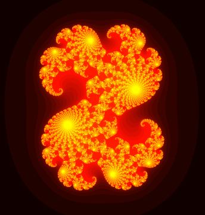

# culia
A CUDA accelerated Julia set animator.

## Dependencies
- CUDA (https://developer.nvidia.com/cuda-toolkit)
- glew (http://glew.sourceforge.net/)
- SDL (http://www.libsdl.org/)

## Build instructions
### Windows
- Install Visual Studio 2022 and Windows SDK
- Install CUDA toolkit
- Download and extract glew (http://glew.sourceforge.net/)
- Download and extract SDL (http://www.libsdl.org/)
- Adapt additional include and library paths to your locations of glew and SDL in VS project settings
- Copy glew (glew32.dll) and SDL (SDL2.dll) binaries to build directory
